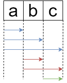

### A1. 字符串的全部组合

【题目】求一个字符串所有字符的全部组合，注意不是全排列，`'ab'`和`'ba'`算一种组合。

【答】《剑指》上提供了一种思路，基于这种思路的代码比如：[https://blog.csdn.net/imzoer/article/details/8035373](https://blog.csdn.net/imzoer/article/details/8035373)。这里说说更常规的思路，比如对于3个元素的字符串`a,b,c`，可能的组合类的元素个数分别为1,2,3个。其中个数为1的组合有`[a],[b],[c]`。个数为2的组合是在个数为1的组合上从未纳入的元素中选一个加入，如：`[a]→[ab]`，`[a]→[ac]`。为了避免题目中说的重复情形，我们规定每次纳入新元素时只能从坐标比它大的元素中选，就如下图所示。按照这个规律就可以写出递归代码了。

